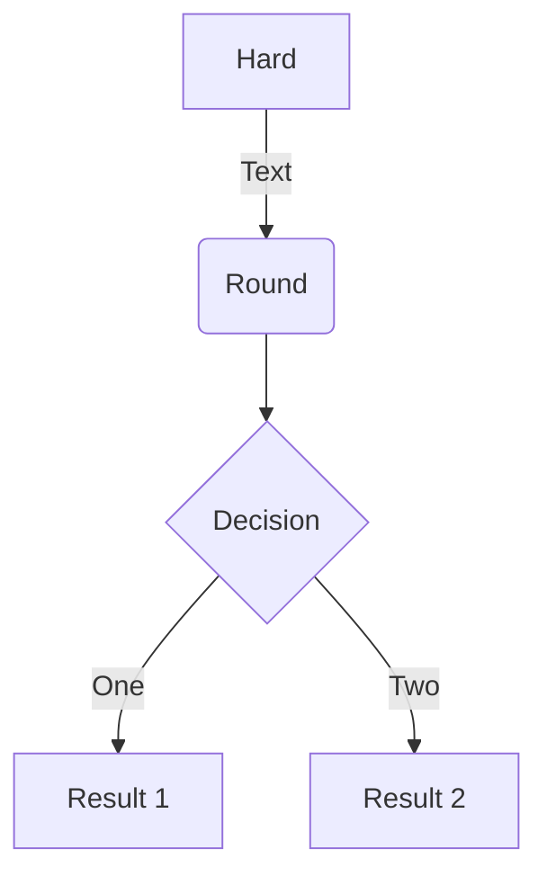
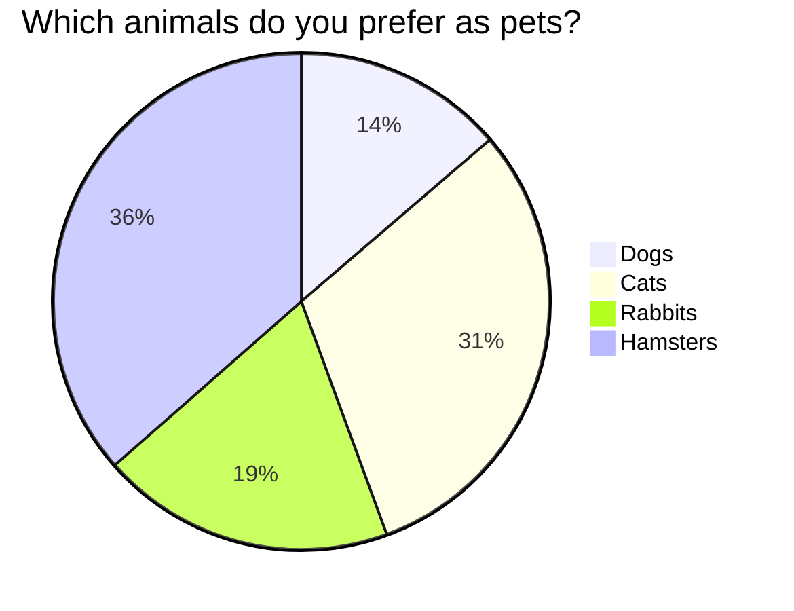
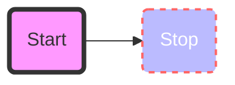
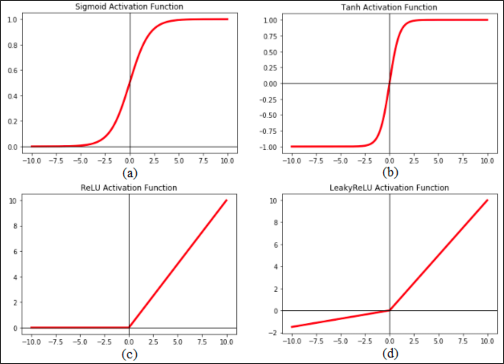

# Welcome to MkDocs

For full documentation visit [mkdocs.org](https://www.mkdocs.org).


## Not working! debug in progress!

with code annotation

``` yaml
theme:
  features:
    - content.code.annotate # (1)! 
```

1.  :man_raising_hand: I'm a code annotation! I can contain `code`, __formatted
    text__, images, ... basically anything that can be written in Markdown.

``` yaml
# (1)!
```

1.  Look ma, less line noise!


## CSS

 :fontawesome-brands-twitter:

 :fontawesome-brands-twitter:{ .twitter }

 :octicons-heart-fill-24:{ .heart }

## Custom fences & Mermaid

```custom_fences
graph TD
    A[Hard] -->|Text| B(Round)
    B --> C{Decision}
    C -->|One| D[Result 1]
    C -->|Two| E[Result 2]
```







For more on diagram syntax: https://mermaid.js.org/intro/

## Table

| First Header | Second Header | Third Header
| :----------- |:-------------:| -----------:
| Left         | Center        | Right :material-check:
| Left         | Center        | Right :material-check-all:
| Left         | Center        | Right :material-close:


## math formula (MathJax) ##

$$
\cos x=\sum_{k=0}^{\infty}\frac{(-1)^k}{(2k)!}x^{2k}
$$

## code and blocks

Indented block (old way!)

    mkdocs.yml    # The configuration file.
    docs/
        index.md  # The documentation homepage.
        ...       # Other markdown pages, images and other files.

Triple ticks (new way!)

```
import tensorflow as tf
def watever
```

Highlight in an inline block `#!python range()` is used to generate a sequence of numbers

Some code with the `file.py` or `py` extension at the start:

```py
import tensorflow as tf
def watever
```

```python {hl_lines="4-5 10" linenums="100" title="My cool header"}
"""some_file.py"""
import tensorflow as tf

def highlighted_block():
    self.destruct()

def not_highlighted():
    pass

def highlighted_line():
    pass
```


## images

{style="width:100%"}
/// caption
Image caption
///


## PDFs

/// warning | Warning
mkdocs-pdf creates an embed tag which is deprecated and replace with 'object' or 'iframe'
///

/// warning | Warning

Github does not support PDF with URL that are redirected. Use the final URL!
///

```
{ type=application/pdf }
```

Redirect (Not supported on github!)

{ type=application/pdf }

Without redirect

{ type=application/pdf }

{ type=application/pdf style="min-height:100vh;width:100%" }


## Smileys and highlights

:smile: and :heart: those ==emojis are awesome,== isn't it?

***

text below rule

## Links & Abbreviations & footnotes

### links

 * open pdf - https://media.geeksforgeeks.org/wp-content/cdn-uploads/20210101201653/PDF.pdf
 * open web - pagehttps://www.google.com

 Do these abbreviations work: CSS, W3C, and not HTML ? What about FAQ, TOC, and GFM?
 Yes if you hover the acronym and 

### abbreviations

In-page abbreviations
*[CSS]: Custom Style Sheet
*[W3C]:  World Wide Web Consortium

Disabled reference abbreviations
*[HTML]: 'H'

### footnotes

Lorem ipsum[^1] dolor sit amet, consectetur adipiscing elit.[^2]

[^1]: Lorem ipsum dolor sit amet, consectetur adipiscing elit.

[^2]:
    Lorem ipsum dolor sit amet, consectetur adipiscing elit. Nulla et euismod
    nulla. Curabitur feugiat, tortor non consequat finibus, justo purus auctor
    massa, nec semper lorem quam in massa.


## Videos

### Works (plugins mkdocs-videos + embed URL)


### Fails

```


{ type=application/video }
```

## admonition

### blocks.adminition

/// note | note: ...
///

/// attention | attention ~ note ...
///

/// caution | caution ~ note ...
///

/// danger | danger ...
///

/// error | error ~ note ...
///

/// hint | hint ~ note ...
///

/// tip | tip ...
///

/// warning | warning ...
///

### blocks.details

/// details | note ...
///

/// details | danger ...
    type: danger
///
/// details | tip ...
    type: tip
///
/// details | question ...
    type: question
///

/// details | warning ...
    type: warning
    open: True

Rendering of pymdownx.blocks.details is function of type, which is a CSS class!
///
