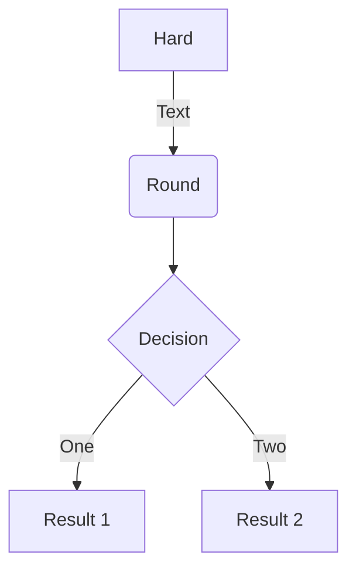
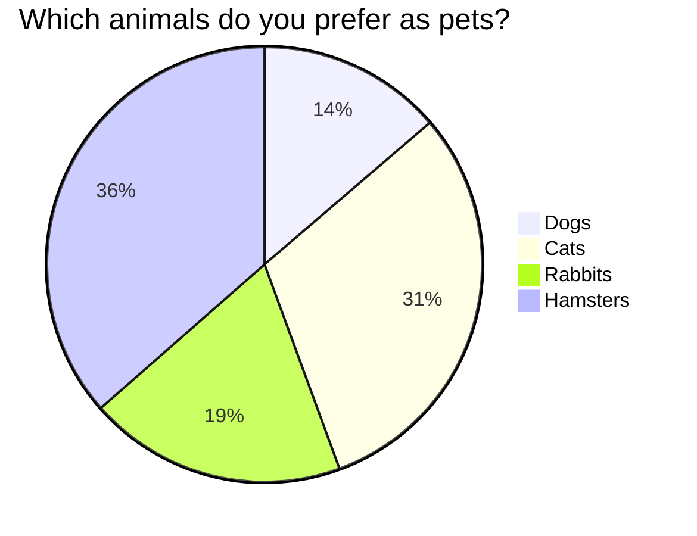
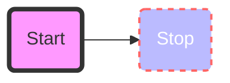

# Welcome to MkDocs

For full documentation visit [mkdocs.org](https://www.mkdocs.org).

## Grid of cards (md_in_html)

### card grids

/// warning | Warning

First div must not be indented

///

<div class="grid cards" markdown>

- :fontawesome-brands-html5: __HTML__ for content and structure
- :fontawesome-brands-js: __JavaScript__ for interactivity
- :fontawesome-brands-css3: __CSS__ for text running out of boxes
- :fontawesome-brands-internet-explorer: __Internet Explorer__ ... huh?

</div>

<div class="grid cards" markdown>

-   :material-clock-fast:{ .lg .middle } __Set up in 5 minutes__

    ---

    Install [`mkdocs-material`](#) with [`pip`](#) and get up
    and running in minutes

    [:octicons-arrow-right-24: Getting started](#)

-   :fontawesome-brands-markdown:{ .lg .middle } __It's just Markdown__

    ---

    Focus on your content and generate a responsive and searchable static site

    [:octicons-arrow-right-24: Reference](#)

-   :material-format-font:{ .lg .middle } __Made to measure__

    ---

    Change the colors, fonts, language, icons, logo and more with a few lines

    [:octicons-arrow-right-24: Customization](#)

-   :material-scale-balance:{ .lg .middle } __Open Source, MIT__

    ---

```
    Material for MkDocs is licensed under MIT and available on [GitHub]
```

    [:octicons-arrow-right-24: License](#)

</div>


<div class="grid" markdown>

:fontawesome-brands-html5: __HTML__ for content and structure
{ .card }

:fontawesome-brands-js: __JavaScript__ for interactivity
{ .card }

:fontawesome-brands-css3: __CSS__ for text running out of boxes
{ .card }

> :fontawesome-brands-internet-explorer: __Internet Explorer__ ... huh?

</div>

## Content Tabs

### simple

=== "Tab A"
    In a different tab set.

=== "Tab B"
    ```
    More content.
    ```

### linked tabs

=== "C"

    C code linked tab

=== "C++"

    C++ code linked tab

===! "C"

    ``` c
    #include <stdio.h>

    int main(void) {
      printf("Hello world!\n");
      return 0;
    }
    ```

=== "C++"

    ``` c++
    #include <iostream>

    int main(void) {
      std::cout << "Hello world!" << std::endl;
      return 0;
    }
    ```


## CSS

 :fontawesome-brands-twitter: :fontawesome-brands-twitter:{ .twitter }

 :fontawesome-brands-youtube: :fontawesome-brands-youtube:{ .youtube }

 :octicons-heart-fill-24: :octicons-heart-fill-24:{ .heart }

## Custom fences & Mermaid

```custom_fences
graph TD
    A[Hard] -->|Text| B(Round)
    B --> C{Decision}
    C -->|One| D[Result 1]
    C -->|Two| E[Result 2]
```







For more on diagram syntax: https://mermaid.js.org/intro/

## Table

| First Header | Second Header | Third Header
| :----------- |:-------------:| -----------:
| Left         | Center        | Right :material-check:
| Left         | Center        | Right :material-check-all:
| Left         | Center        | Right :material-close:


## math formula (MathJax)

$$
\cos x=\sum_{k=0}^{\infty}\frac{(-1)^k}{(2k)!}x^{2k}
$$

## blocks and code-blocks

### blocks

Indented block (old way!)

    mkdocs.yml    # The configuration file.
    docs/
        index.md  # The documentation homepage.
        ...       # Other markdown pages, images and other files.

Triple ticks (new way!)

```
import tensorflow as tf
def watever
```


### code

Highlight in an inline block `#!python range()` is used to generate a sequence of numbers

Some code with the `file.py` or `py` extension at the start:

```py
import tensorflow as tf
def watever
```

```python {hl_lines="4-5 10" linenums="100" title="My cool header"}
"""some_file.py"""
import tensorflow as tf

def highlighted_block():
    self.destruct()

def not_highlighted():
    pass

def highlighted_line():
    pass
```

with code annotation

``` yaml
theme:
  features:
    - content.code.annotate # (1)! 
```

1.  :man_raising_hand: I'm a code annotation! I can contain `code`, __formatted
    text__, images, ... basically anything that can be written in Markdown.

``` yaml
# (1)!
# (2)!
```

1.  Look ma, less line noise!
2.  Look ma, more noise!

## images

Relative path

{style="width:100%"}
/// caption
Image caption
///

Absolute path (not recommended!)

```

```

### Fails

```

```


## PDFs

/// warning | Warning
mkdocs-pdf creates an embed tag which is deprecated and replace with 'object' or 'iframe'
///

/// warning | Warning

Github does not support PDF with URL that are redirected. Use the final URL!
///

```
{ type=application/pdf }
```

Redirect (Not supported on github!)

{ type=application/pdf }

Without redirect

{ type=application/pdf }

{ type=application/pdf style="min-height:100vh;width:100%" }


## Smileys and highlights/marks

:smile: and :heart: those ==emojis are awesome,== isn't it?

***

text below rule

## Links & Tooltips & Abbreviations & footnotes

### links

 * open pdf - https://media.geeksforgeeks.org/wp-content/cdn-uploads/20210101201653/PDF.pdf
 * open web - page https://www.google.com

 [:octicons-arrow-right-24: Google](https://www.google.com "Go to Google")


Work:

 * https://www.ggogle.com
 * [markdown link to a](glossary/a.md#ablation)
 * [in-page Reference-Style external Links][markdown syntax]
 * [in-page Reference-Style internal Links][glossary link]
 * [markdown syntax]
 * [glossary link] and [GloSSAry Link]

```
 * [snippets admonition][ablation]
 * direct snippets [ablation] and [accuracy]
```

[markdown syntax]: https://daringfireball.net/projects/markdown/syntax#link "title"
[glossary link]: glossary/a.md#ablation "title"

```
Deprecated by snippets

 * [include-markdown links toto]
 * [include-markdown links_a titi] = include of include!

```

Fail:

```
 * [#big] just to anchor (fails)
 * [in-page Reference-Style no match][no match]
```

### tooltips

:material-information-outline:{ title="Important information" }

[Hover me using inline syntax](https://example.com "I'm a tooltip!")

```
[Hover me using external reference link][example]
```

[Hover me using internal reference link][example2]

  [example2]: https://example.com "I'm a tooltip!"

### abbreviations

 Do these abbreviations work: CSS, W3C, and not HTML ? What about FAQ, Faq, TOC, Toc, and GFM?
 Yes if you hover the acronym !

/// danger| beware
abbreviations are case sensitive
///

In-page abbreviations
*[CSS]: Custom Style Sheet
*[W3C]:  World Wide Web Consortium

Disabled reference abbreviations
*[HTML]: 'H'

### footnotes

Lorem ipsum[^1] dolor sit amet, consectetur adipiscing elit.[^2]

[^1]: Lorem ipsum dolor sit amet, consectetur adipiscing elit.

[^2]:
    Lorem ipsum dolor sit amet, consectetur adipiscing elit. Nulla et euismod
    nulla. Curabitur feugiat, tortor non consequat finibus, justo purus auctor
    massa, nec semper lorem quam in massa.


## Videos

### Works (plugins mkdocs-videos + embed URL)


### Fails

```


{ type=application/video }
```

## admonition

### blocks.adminition

/// note | note: ...
///

/// attention | attention ~ note ...
///

/// caution | caution ~ note ...
///

/// danger | danger ...
///

/// error | error ~ note ...
///

/// hint | hint ~ note ...
///

/// tip | tip ...
///

/// warning | warning ...
///

### blocks.details

/// details | note ...
///

/// details | danger ...
    type: danger
///
/// details | tip ...
    type: tip
///
/// details | question ...
    type: question
///

/// details | warning ...
    type: warning
    open: True

Rendering of pymdownx.blocks.details is function of type, which is a CSS class!
///
